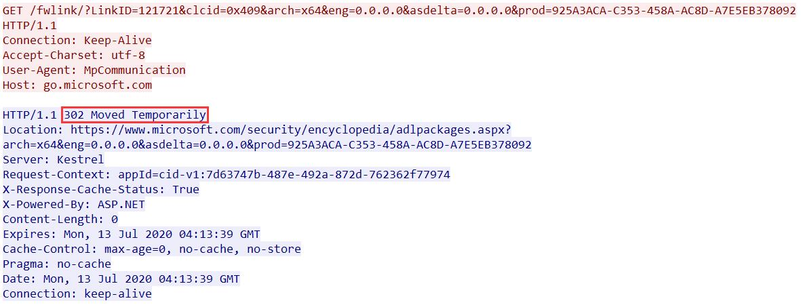
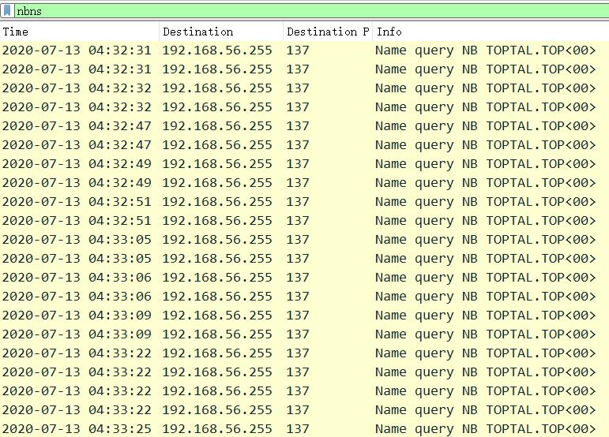

## 分析工具

Cuckoo + Wireshark

### Cuckoo Guest 端

Hostname：HappyWin

## [W32.GetiposLTP.Trojan](https://s3.eu-central-1.amazonaws.com/dasmalwerk/downloads/c86fd81aede1a694f978ee09be2f16c6bcd335741538e666883d69dbb9c4c1ae/c86fd81aede1a694f978ee09be2f16c6bcd335741538e666883d69dbb9c4c1ae.zip)

### HTTP requests

- 最初发送了一个 HTTP 请求，被 302 重定向 

- 随后依次请求了`www.microsoft.com`、`definitionupdates.microsoft.com` 
-request.jpg)
- 通过 Cuckoo 的解密结果来看，通过最后请求的`definitionupdates.microsoft.com`下载了文件`mpas-fe.exe` 

- 有点奇怪，`mpas-fe.exe`作为微软出品的反间谍软件为什么会出现在这里？【防火墙和自动更新均已关闭】 

### DNS Resolutions

Windows 域名解析顺序：`本地（检查自身域名 -> 检查 Hosts 文件）-> 询问 DNS 服务器 -> NBNS`

- 询问一个 DNS 服务器查找不到的域名`toptal.top` 

- 随后产生了大量的 NBNS 请求 

- 作为木马程序，可能需要与攻击者主机通信，而不是通过制造大量 NBNS 请求来使网络瘫痪，因此推测`toptal.top`是攻击者主机名

## 实验总结

- 因为之前刚好搭了 [Cuckoo 的环境](https://github.com/YanhuiJessica/2020-SSS-Public-YanhuiJessica/tree/master/lab0x08%20Sandbox)，想顺便借用 Cuckoo 进行辅助分析，但刚开始怎么都抓不到网络通信流量，根据 [Cuckoo 官方在线的分析结果](https://cuckoo.cert.ee/analysis/1781358/summary/) 来看，应该是有网络通信过程的。以为是自己本地 Cuckoo 的配置出现了问题，但相关 Issue 中遇到问题的原因并不是本地具有的。最后发现是设定的最长分析时间不够长，主要由于内嵌虚拟机的速度不够快，短时间内程序跑不出结果(╥ω╥)
  - ~~如果 Cuckoo 官方在线分析也能抓 PCAP 包就好了，~~ 该换电脑了
  - 下次要不试试 Security Onion XD
- W32.GetiposLTP.Trojan 没能联系上攻击者，未能从本次抓包中获取更多的情报

## 参考资料

- [Microsoft TCP/IP Host Name Resolution Order](https://support.microsoft.com/en-ph/help/172218/microsoft-tcp-ip-host-name-resolution-order)