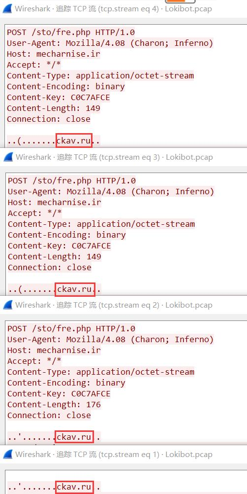
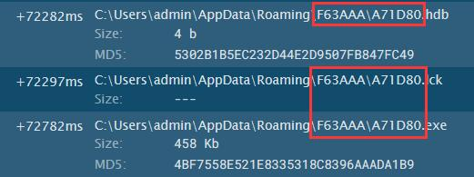
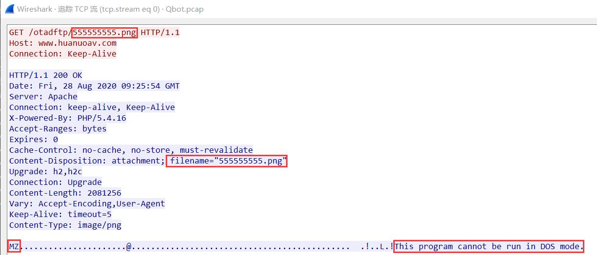

## Lokibot

[a01bf1b6d036f34c2e2dd8740c769883725731bbe4d006e6c5ab399fc9cb338a (MD5: 816762B6B010D971F6BD32ECECB1E0B1) - Interactive analysis - ANY.RUN](https://app.any.run/tasks/65faf741-0dfb-4a76-b8ba-858cd5de0405#)

### DNS Resolutions

Domain | IP | CnC Server
-|-|-
www.onlygodem.com|91.223.82.173|
mecharnise.ir|194.180.224.87| ✔

### HTTP Requests

- 首先从`www.onlygodem.com`下载可执行文件并运行该可执行文件，该可执行文件为实际的 LOKIBOT<br>

- 发送的 HTTP 请求中始终包含`ckav.ru`字段，是 LOKIBOT 的特征<br>

- 向 CnC 服务器发送的信息主要为基本系统信息，`8569 AAFF 63AA A71D 8040 0E25`为被入侵主机 MachineGuid 的 MD5 哈希值的前 **24** 位【参考 [27.08.2020, 13:55](https://app.any.run/tasks/f5ebb762-8b7f-4891-9526-104b51da9bb7) 的运行结果】<br>

  ```bash
  $ echo -n '90059c37-1320-41a4-b58d-2b75a9850d2f' | md5sum
  8569aaff63aaa71d80400e2571e89667  -
  # 8569,aaff,63aa,a71d,8040,0e25,71e8,9667
  ```
- 被入侵主机 MachineGuid 的 MD5 哈希值的第 8 到第 13 位作为 LOKIBOT 创建的文件夹名，第 13 到第 18 位为文件名<br>


## Qbot

[2c0347794bdcfd994b2785246ba679e43b144351d2d68c60ce380ec96edd9e45 (MD5: 4D86E132C5D0D3748B69E9CECB18DA1E) - Interactive analysis - ANY.RUN](https://app.any.run/tasks/544b0135-54a5-4ba9-8d9f-e5e4d1789bf1)

### DNS Resolutions

Domain | IP
-|-
www.huanuoav.com|132.148.215.84

### HTTP Requests

利用`powershell.exe`从`www.huanuoav.com`下载文件名为`555555555.png`的可执行文件，并运行，该可执行文件创建了具有 Qbot 特征的文件夹及文件<br>


### Others

位于`C:\Users\admin\AppData\ Roaming\Microsoft\`目录下由恶意软件创建的文件，独特的文件夹名`Zuycjadyc`和文件名`ytfovlym`是 Qbot 的特征<br>


## 参考资料

- [Lokibot - Malware Trends Tracker by ANY.RUN](https://any.run/malware-trends/lokibot)
- [Qbot - Live malware statistic by ANY.RUN](https://any.run/malware-trends/qbot)